# Landmark Classification & Tagging

Images are being uploaded to social media platforms everyday. During upload, these services can automatically tag the image with its location based on the image metadata (such as GPS coordinates).

However, when the image does not contain GPS data, an alternate method to pinpoint the location where the photo was taken is to identify a recognizable landmark in the picture. This can be performed with a CNN.

In this project convolutional neural networks (CNNs) are built for identifying landmarks on social media images. 
The project explores two methodologies: 
- building a neural network from scratch
- building a neural network using transfer learning (based on the VGG16 pre-trained model).

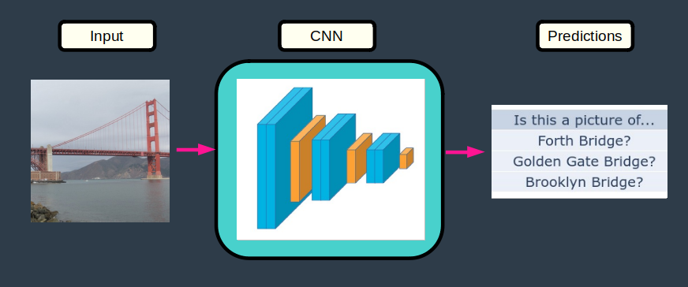

# Data

### Input Data

CNNs in this project are trained using a subset of Google's Landmark Detection Dataset. This dataset contains about 6000 images divided into 50 categories.  Image category ID/names are stored in file `categories.json`.

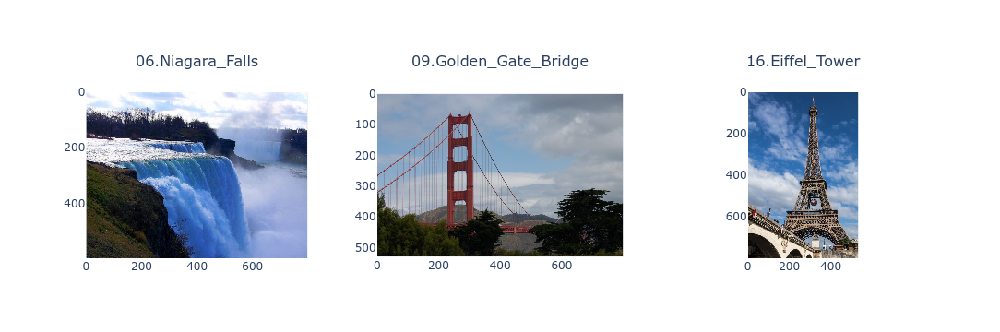 

### Train-Test Datasets

The landmark images were already split into training and testing datasets by Udacity.

| datasets   | data_points   | %_total   |
|:-----------|:--------------|:----------|
| train      | 4996          | 80        |
| test       | 1250          | 20        |
| -          | -             | -         |
| total      | 6246          | 100       |

### Category Distributions

- There are 100 images/category in the training dataset
- There are 25 images/category in the testing dataset.

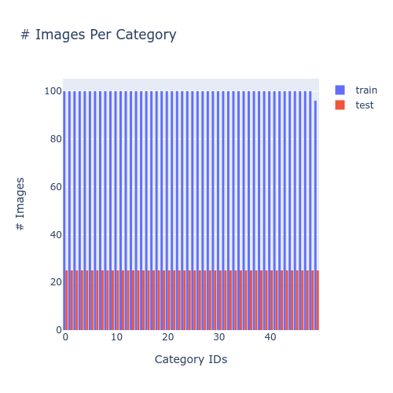

### Image Sizes

- Most images are < 200 kB.
- The largest images are 800 x 800 pixels.
- Most images have one side which is 800 pixels.

<table>
    <tr>
        <td>
            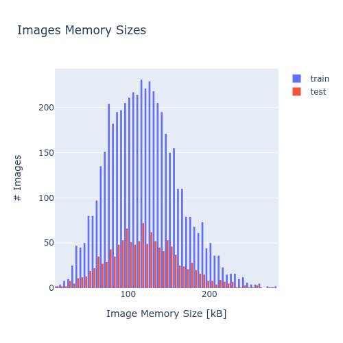
        </td>
        <td>
            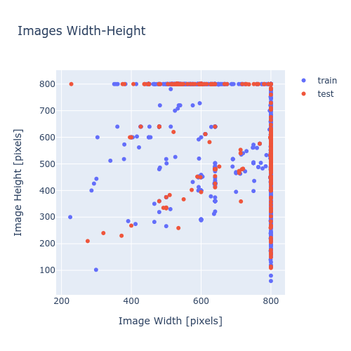
        </td>
    <tr>
</table>

### Pipeline

The neural networks developped in this project are part of the following machine learning pipeline.

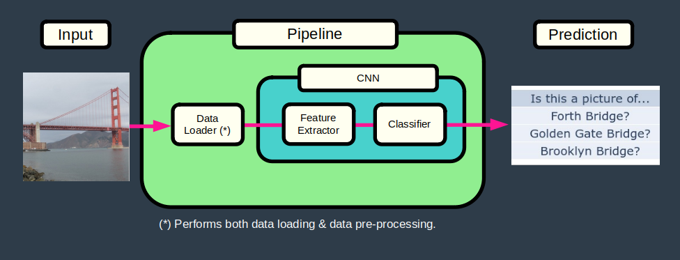

### Valid Dataset

A validation dataset was created by taking 25 % of the train dataset. This created a final train-valid-test data split of 60-20-20%.

### Data Loaders

Data loaders read images from disk, perform pre-processing on these images and return tensors which can be manipulated by the neural networks.

The **training dataloader** performs the following data pre-processing (which includes data augmentation).

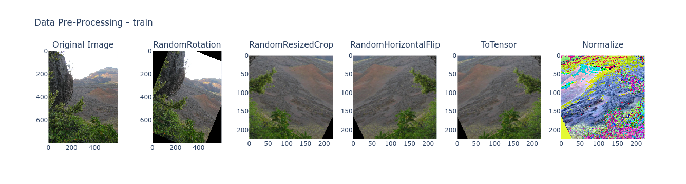 

And the **validation/test dataloaders** perform the following pre-processing.

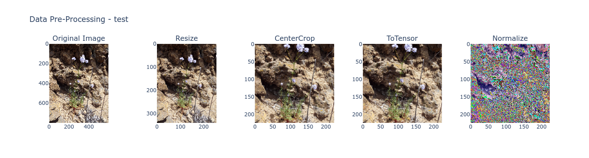

### CNN 1 - From Scratch

A first neural network built from scratch. This model used the following architecture, which is a simplified version of VGG16. 

See class `NeuralNetworkScratch` and function `get_model_scratch` for exact architecture.

| Component         | Layers                    | Size          |
|-------------------|---------------------------|---------------|
| Input             | RGB Image                 | 224 x 224 x 3 |
| Feature Extractor | 2 conv layer + 1 max pool |               |
|                   | 2 conv layer + 1 max pool |               |
|                   | 2 conv layer + 1 max pool |               |
| Classifier        | Flatten layer + dropout   |               |
|                   | 1 fully connected + ReLU  |               |
|                   | 1 fully connected + ReLU  |               |
| Output            | Log Softmax               | 50            |

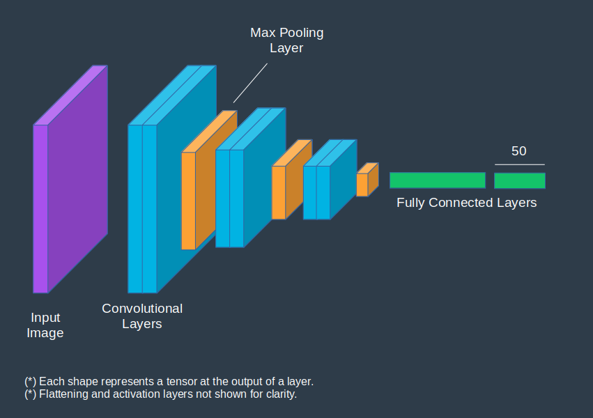

### CNN 2 - From Transfer Learning

The 2nd neural network uses a pre-trained version of the VGG16 neural network, with its classifier replaced by the same classifier as CNN 1 above.

As per reference, only the classifier weights are retrained since:

- the new dataset is small (~6000 images) while VGG16 was trained over 1.2 million images;
- the new dataset is similar to the dataset on which VGG16 was trained.

See function `get_model_transfer` for exact architecture.

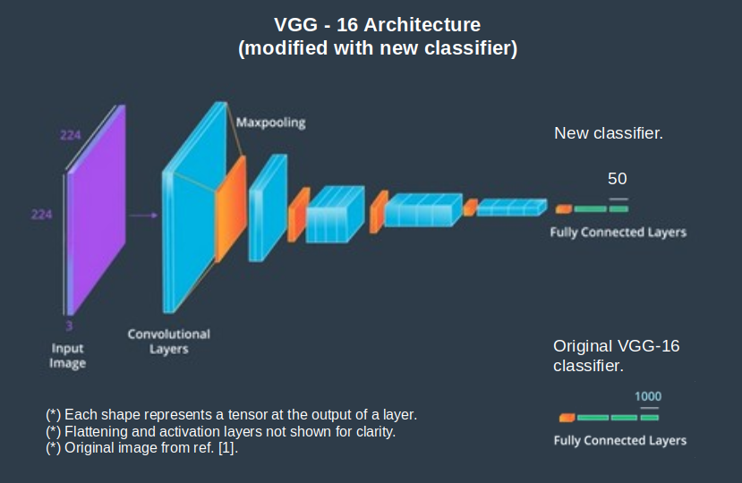

### Train

Both neural networks are trained using the following parameters.

| Parameter      | Method                       | Value / Function |
|----------------|------------------------------|------------------|
| Error function | Negative Log Loss Likelihood | nn.NLLLoss()     |
| Metrics        | Accuracy                     | > 60 %           |
| Batching       | Mini-batches                 | 64 data points   |
| Optimizer      | Stochastic Gradient Descent  | nn.optim.SGD()   |
| Epochs         | -                            | 50               |                     
| Learning rate  | -                            | 0.01             |

CNN 1 learning curves.

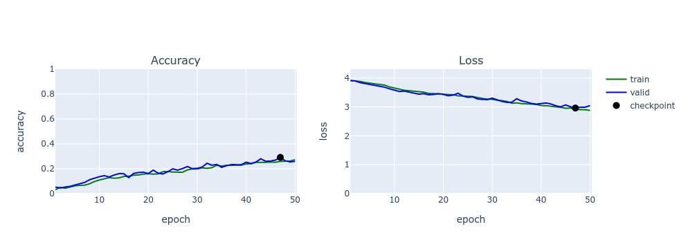

CNN 2 learning curves.

### Test

CNN 2 met the accuracy requirement and was selected as the best model. It was ran on the test dataset and the accuracy requirement was still met.

| Neural Network                 | Test accuracy    |
|--------------------------------|------------------|
| CNN 2 (from transfer learning) | 74 %            |
